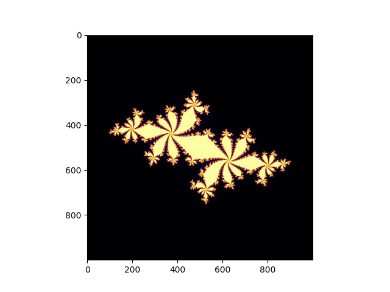

# Julia Set Problem

### In the context of complex dynamics, a topic of mathematics, the Julia set and the Fatou set are two complementary sets (Julia "laces" and Fatou "dusts") defined from a function. Informally, the Fatou set of the function consists of values with the property that all nearby values behave similarly under repeated iteration of the function, and the Julia set consists of values such that an arbitrarily small perturbation can cause drastic changes in the sequence of iterated function values. Thus the behavior of the function on the Fatou set is "regular", while on the Julia set its behavior is "chaotic". credit: wikipedia

### In this particular implementation of the Julia set, the equation is z = z^2 + c

### The main objective of this program is to demonstrate how vectorization can help write more efficient algorithms

### In this program, I managed to reduce the computation time expense from 14.168912410736084 seconds to 4.78585 seconds by using numpy vectorization rather than pure Python loops

### I found this exercise really intuitive, so I recommend you to rewrite it from scratch and line profile it to observe the noticeable difference in time between these programs, which is due to lines that are carrying out vectorization

###  The line-by-line profiling and cprofiling are also included in this repository

### Output of the Code

